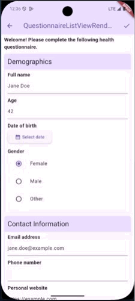
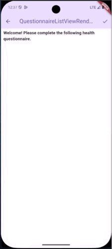
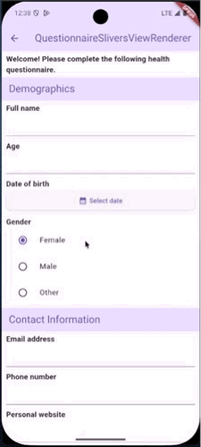

# FHIR Renderer Questionnaire
A Flutter package for FHIR® Questionnaires. HL7®, and FHIR® are the registered trademarks of Health Level Seven International and their use of these trademarks does not constitute an endorsement by HL7.

This package was inspired by [fhir_questionnaire](https://pub.dev/packages/fhir_questionnaire). Built to allow isolated customization and different ways to render a [FHIR R4 Questionnaire](https://hl7.org/fhir/R4/questionnaire.html).

## 🔆 Why fhir_renderer_questionnaire?

- **🎨 Customization** — Replace the default Questionnaire Item widgets with your own to achieve the desired UI.
- **🤸 Flexibility** — Use the RendererView that suits you the best (ListViewRenderer, PageViewRenderer, SliversViewRenderer).
- **🚀 Rapid Development:** Automatically generates UI from FHIR R4 Questionnaires, saving time compared to building forms manually.
- **📝 Automatic QuestionnaireResponse Generation:** Collects user input and produces a valid `QuestionnaireResponse`.
- **⚙️ Behavior Handling:** Manages conditional logic (`enableWhen` and `required`) out of the box.

## 🔆 Widgets
✳️  In order to provide full customization, not only for the `QuestionnaireItems` but also the `Questionnaire` itself, there are **three widgets for rendering** a questionnaire: `QuestionnaireListViewRenderer`, `QuestionnairePageViewRenderer` and `QuestionnaireSliversViewRenderer`. 
✳️ The three `Renderer` widgets use by default the theme of your application.


### 💫 QuestionnaireListViewRenderer

<div align="center">

</a>
</div>


💡 Ideal for long questionnaires as it uses `ListView.builder` under the hook.

```dart
QuestionnaireListViewRenderer(
    questionnaire: questionnaire,
    getRendererControllerInstance: (QuestionnaireRendererController controller) {
        //Assign here the instance of the Renderer Controller
    }
);
```

### 💫 QuestionnairePageViewRenderer

<div align="center">

</a>
</div>

💡 Ideal for strict grouping in the questionnaires as gives the user a clear separation of the `QuestionnaireItems`.

```dart
QuestionnairePageViewRenderer(    
    questionnaire: questionnaire,
    getRendererControllerInstance: (QuestionnaireRendererController controller) {
        //Assign here the instance of the Renderer Controller
    };
)
```

### 💫 QuestionnaireSliversViewRenderer

<div align="center">

</a>
</div>

💡 Ideal for fancy behaviors through your questionnaire.

```dart
QuestionnaireSliversViewRenderer(    
    questionnaire: questionnaire,
    getRendererControllerInstance: (QuestionnaireRendererController controller) {
        //Assign here the instance of the Renderer Controller
    };
)
```

## 🔆 Usage

```dart

import 'package:fhir_r4/fhir_r4.dart';
import 'package:fhir_renderer_questionnaire/fhir_renderer_questionnaire.dart';
import 'package:flutter/material.dart';

//Cubit or Bloc or Controller for the view to assign
//the QuestionnaireRendererController instance.
class _CubitOrBlocOrController {
  QuestionnaireRendererController? rendererController;
}

class ListViewExamplePage extends StatelessWidget {
  final Questionnaire questionnaire;
  ListViewExamplePage({super.key, required this.questionnaire});

  final _CubitOrBlocOrController controller = _CubitOrBlocOrController();

  @override
  Widget build(BuildContext context) {
    return Scaffold(
      appBar: AppBar(
        title: Text("QuestionnaireListViewRenderer"),
        actions: [
          IconButton(
            onPressed: () {
              final generatedQuestionnaireResponse =
                  controller.rendererController
                      ?.getGeneratedQuestionnaireResponse();

              //Do something with the generated response
            },
            icon: Icon(Icons.check),
          ),
        ],
      ),
      // Here goes the Renderer of your choice
      body: QuestionnaireListViewRenderer(
        questionnaire: questionnaire,
        getRendererControllerInstance:
            (QuestionnaireRendererController controller) =>
                this.controller.rendererController = controller,
      ),
    );
  }
}
```

## 🔆 Supported Questionnaire Items

Currently **fhir_renderer_questionnaire** supports the following item types from FHIR R4: `group`, `display`, `boolean`, `decimal`, `integer`, `date`, `dateTime`, `time`, `string`, `text`, `url`, `choice`, `openChoice` and `quantity`.